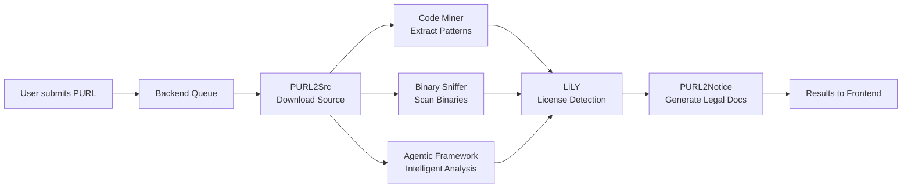

# 🛡️ Copycat Code Defender

> **Comprehensive code similarity detection and license compliance platform**

## 📊 Project Overview

### Overall Project Completion

**62.5%** Complete 🟠 **5/8** Components Ready

██████████████████░░░░░░░░░░░░

---

## 🔄 Analysis Workflow

The platform orchestrates a comprehensive analysis pipeline:

1. **User Input**: Submit Package URL through web interface
2. **Source Retrieval**: Download complete source code
3. **Pattern Analysis**: Extract code patterns and signatures
4. **Binary Scanning**: Identify hidden OSS in compiled files
5. **Intelligent Analysis**: Apply agentic framework for advanced detection
6. **License Detection**: Classify and validate licenses
7. **Notice Generation**: Create comprehensive legal documentation

---

## 🎯 Component Status Dashboard

*Last updated: 2025-08-13 07:03:08 UTC*

| Component | Version | License | Status | Progress | Open Tickets | Links |
|-----------|---------|---------|--------|----------|--------------|-------|
| **Frontend UI** *Web interface for scan submission and results visualization* | 0.0.0 | MIT | 🚧 | ░░░░░░░░░░ 0% | - | GitHub (planned) |
| **Backend API** *Core API services with scan queue management and orchestration* | 0.0.0 | MIT | 🚧 | ░░░░░░░░░░ 0% | - | GitHub (planned) |
| **PURL to Source** *Downloads source code from Package URLs (npm, PyPI, Maven, etc.)* | 0.1.1 | MIT | ✅ | ██████████ 100% | - | [GitHub](https://github.com/oscarvalenzuelab/semantic-copycat-purl2src) · [PyPI](https://pypi.org/project/semantic-copycat-purl2src/) |
| **Code Miner** *Extracts code patterns and performs initial license detection* | 1.7.0 | Proprietary | ✅ | ██████████ 100% | - | Private Repo |
| **Binary Sniffer** *Identifies hidden OSS components embedded in binary files* | 1.9.5 | MIT | ✅ | ██████░░░░ 69% | 5 | [GitHub](https://github.com/oscarvalenzuelab/semantic-copycat-binarysniffer) · [PyPI](https://pypi.org/project/semantic-copycat-binarysniffer/) |
| **Open Agentic Framework** *Agentic AI for Compliance and Risk Analysis* | 0.0.0 | Apache-2.0 | ✅ | ██████████ 100% | 20 | [GitHub](https://github.com/oscarvalenzuelab/open_agentic_framework) |
| **LiLY Inspector** *Advanced license detection and classification engine* | 0.0.0 | MIT | 🚧 | ░░░░░░░░░░ 0% | - | GitHub (planned) |
| **PURL to Notice** *Generates legal notices with licenses and copyright information* | 0.0.0 | MIT | ✅ | ██████████ 100% | - | [GitHub](https://github.com/oscarvalenzuelab/semantic-copycat-purl2notice) |

---

## 📋 Component Details

### 🏗️ Web Platform

#### 🔴 Frontend UI (`semantic-copycat-frontend`)

> Web interface for scan submission and results visualization

*Component not yet initialized*

#### 🔴 Backend API (`semantic-copycat-backend`)

> Core API services with scan queue management and orchestration

*Component not yet initialized*

### 🏗️ Analysis Pipeline

#### 🟢 PURL to Source (`semantic-copycat-purl2src`)

> Downloads source code from Package URLs (npm, PyPI, Maven, etc.)

| Metric | Value |
|--------|-------|
| **Current Version** | 0.1.1 |
| **License** | MIT |
| **Completion** | 100.0% |
| **Open Issues** | 0 |
| **Closed Issues** | 0 |
| **Total Issues** | 0 |

#### 🟢 Code Miner (`semantic-copycat-miner`)

> Extracts code patterns and performs initial license detection

| Metric | Value |
|--------|-------|
| **Current Version** | 1.7.0 |
| **License** | Proprietary |
| **Completion** | 100.0% |
| **Open Issues** | 0 |
| **Closed Issues** | 0 |
| **Total Issues** | 0 |

#### 🟠 Binary Sniffer (`semantic-copycat-binarysniffer`)

> Identifies hidden OSS components embedded in binary files

| Metric | Value |
|--------|-------|
| **Current Version** | 1.9.5 |
| **License** | MIT |
| **Completion** | 68.8% |
| **Open Issues** | 5 |
| **Closed Issues** | 11 |
| **Total Issues** | 16 |

#### 🟢 Open Agentic Framework (`open-agentic-framework`)

> Agentic AI for Compliance and Risk Analysis

| Metric | Value |
|--------|-------|
| **Current Version** | 0.0.0 |
| **License** | Apache-2.0 |
| **Completion** | 100.0% |
| **Open Issues** | 20 |
| **Closed Issues** | 11 |
| **Total Issues** | 31 |

### 🏗️ License Analysis

#### 🔴 LiLY Inspector (`semantic-copycat-lily`)

> Advanced license detection and classification engine

*Component not yet initialized*

#### 🟢 PURL to Notice (`semantic-copycat-purl2notice`)

> Generates legal notices with licenses and copyright information

| Metric | Value |
|--------|-------|
| **Current Version** | 0.0.0 |
| **License** | MIT |
| **Completion** | 100.0% |
| **Open Issues** | 0 |
| **Closed Issues** | 0 |
| **Total Issues** | 0 |

---

## 📈 Summary Statistics

| Total Components | Ready | In Development | Total Issues | Resolved | Open |
|-----------------|-------|----------------|--------------|----------|------|
| **8** | **5** | **3** | **47** | **22** | **25** |

**Issues Resolution Rate:** 46.8%

---

## 🚀 Getting Started

Visit each component's repository for specific setup instructions and documentation.

## 📄 License

Copyright © 2025 Copycat Code Defender Project
