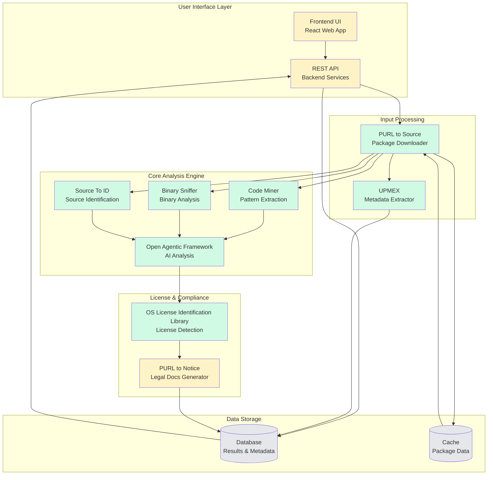
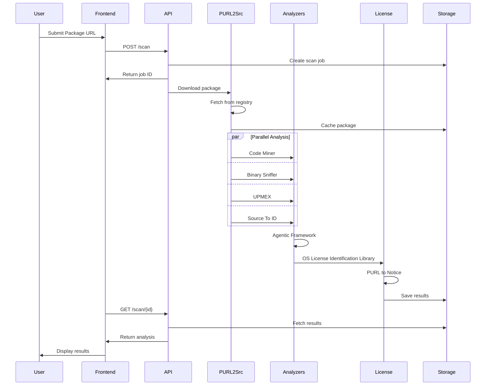
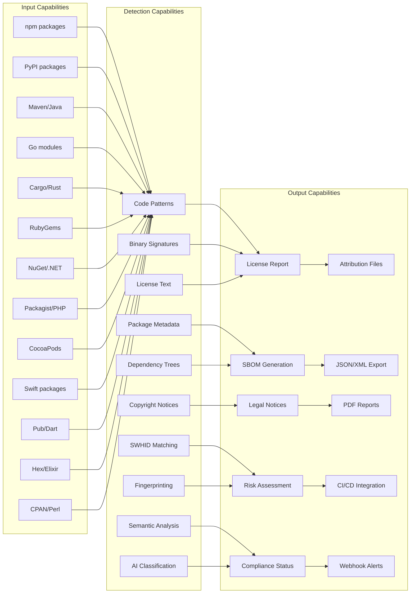
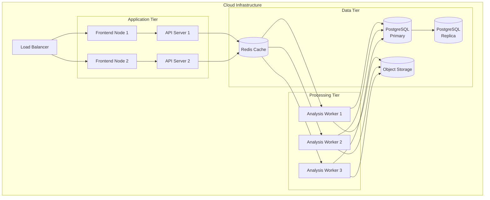

# Code Copycat Defender - Capability Map

## System Architecture Diagram

## Data Flow Diagram

## Capability Matrix

## Component Status & Capabilities

| Component | Status | Key Capabilities |
|-----------|--------|------------------|
| **Frontend UI** | 🚧 Development | • Web-based submission interface • Results visualization • Report generation • User authentication |
| **Backend API** | 🚧 Development | • RESTful endpoints • Job queue management • Webhook notifications • Rate limiting |
| **PURL to Source** | ✅ Ready | • 13+ package registries • Automatic unpacking • Version resolution • Cache management |
| **Code Miner** | ✅ Ready | • Pattern extraction • Code fingerprinting • Initial license detection • Semantic analysis |
| **Binary Sniffer** | ✅ Ready | • ELF/PE analysis • String extraction • Symbol detection • Embedded OSS finding |
| **Agentic Framework** | ✅ Ready | • AI-powered analysis • Pattern learning • Risk scoring • Intelligent classification |
| **OS License Identification Library** | ✅ Ready | • 700+ SPDX licenses • Confidence scoring • Multi-method detection • Evidence collection |
| **PURL to Notice** | 🚧 Development | • Legal notice generation • Attribution formatting • License text inclusion • Compliance documentation |
| **UPMEX** | ✅ Ready | • Universal metadata parsing • 13 ecosystems support • Dependency extraction • SBOM data collection |
| **Source To ID** | ✅ Ready | • SWHID generation • Package identification • Web search integration • SCANOSS fingerprinting |

## Technology Stack

### Languages & Frameworks
- **Python 3.9+**: Core analysis engine
- **TypeScript/React**: Frontend UI
- **FastAPI**: Backend API
- **PostgreSQL**: Data storage
- **Redis**: Caching & queues

### Key Technologies
- **Software Heritage IDs (SWHID)**: Content-based identification
- **SPDX**: License standardization
- **CycloneDX/SPDX**: SBOM formats
- **Docker**: Containerization
- **Kubernetes**: Orchestration (planned)

### Integrations
- **GitHub Actions**: CI/CD automation
- **GitLab CI**: Pipeline integration
- **Jenkins**: Enterprise CI support
- **Webhooks**: Real-time notifications
- **REST API**: Programmatic access

## Deployment Architecture

## Use Cases

### 1. Enterprise Compliance Scanning
- Submit internal packages for analysis
- Generate SBOM for all dependencies
- Identify license conflicts
- Create attribution documents

### 2. Supply Chain Security
- Detect embedded OSS in binaries
- Identify unknown components
- Track package provenance
- Risk assessment scoring

### 3. Legal & Compliance Teams
- Automated notice generation
- License compatibility checking
- Copyright attribution
- Audit trail maintenance

### 4. CI/CD Integration
- Pre-commit scanning
- Pull request checks
- Release validation
- Continuous monitoring

### 5. Open Source Projects
- License verification
- Dependency analysis
- Attribution management
- Compliance documentation

## Roadmap

### Phase 1: Core Engine (70% Complete)
- ✅ Package download & extraction
- ✅ Pattern analysis & mining
- ✅ Binary scanning
- ✅ License detection
- ✅ AI-powered analysis
- ✅ Metadata extraction
- ✅ Source identification
- 🚧 Notice generation

### Phase 2: Platform (In Progress)
- 🚧 Web interface
- 🚧 REST API
- 🚧 Authentication & authorization
- ⬜ Batch processing
- ⬜ Report generation

### Phase 3: Enterprise Features (Planned)
- ⬜ Multi-tenant support
- ⬜ LDAP/SSO integration
- ⬜ Custom policy engine
- ⬜ Compliance dashboards
- ⬜ Advanced analytics

### Phase 4: Ecosystem Integration (Future)
- ⬜ IDE plugins
- ⬜ Container scanning
- ⬜ Cloud marketplace
- ⬜ SaaS offering
- ⬜ API marketplace